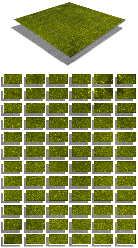

# DS9 FITS Segmentation with Linux and macOS Shell Script Metaprogramming


Segmenting FITS imaging with DS9 and shell scripting.

---

<figure>
  
  <figcaption>Figure 1. FITS file segmentation into smaller images. Data shown are public domain CTIO Blanco 4 m telescope, Mosaic II imaging, toward the Galactic bulge ([O III] on/off band RGB frames and corresponding difference frames).</figcaption>
</figure>

---

## Table of Contents

- [Key Files](#key-files)
- [Supplementary Files](#supplementary-files)
- [Software Requirements](#software-requirements)
- [Quality Assurance](#quality-assurance)
- [Installation](#installation)
- [Getting Started](#getting-started)
- [Acknowledgements](#acknowledgements)
- [References](#references)

---

## Key Files

| File                    | Notes              |
| :---------------------- | :----------------- |
| `src/fits_segmenter.sh` | Bash shell script. |

The Bash shell script automates segmentation of FITS files into smaller JPEG
image segments. The script executes metaprogrammed DS9 command line functions.
It supports arbitrary-resolution FITS files and screen sizes.

> [!NOTE]
> The shell script assumes a single-monitor system setup.

## Supplementary Files

| File                 | Notes                         |
| :------------------- | :---------------------------- |
| `src/differencer.cl` | IRAF Command Language script. |

The IRAF Command Language script `differencer.cl` was used to create difference
FITS files (test data) from on/off-band [O III] FITS files. The FITS segmenter
doesn't need it to run, but it's included here for the purposes of reproducing
testing data.

## Software Requirements

| Software                 | Notes                                                                                                                                                                                                                                                        |
| :----------------------- | :----------------------------------------------------------------------------------------------------------------------------------------------------------------------------------------------------------------------------------------------------------- |
| Bash<br>&nbsp;<br>&nbsp; | Command interpreter and language.<br>&nbsp;&nbsp;&nbsp;Linux: included in most distributions.<br>&nbsp;&nbsp;&nbsp;macOS: included in <!-- textlint-disable terminology -->Mac OS X<!-- textlint-enable terminology --> 10.2 (2002) &ndash; macOS 27 (2026). |
| DS9<br>&nbsp;            | [Available here](https://sites.google.com/cfa.harvard.edu/saoimageds9). Free.<br>&nbsp;&nbsp;&nbsp;For DS9 on the macOS, an X11 port, not Aqua port, is needed.                                                                                              |
| IRAF<br>&nbsp;           | [Available here](https://iraf-community.github.io/). Free. <br>&nbsp;&nbsp;&nbsp;Optional. Only needed by `differencer.cl`.                                                                                                                                  |

## Quality Assurance

### 1. fits_segmenter.sh

The FITS segmenter was tested with the following system configurations.

| Operating System                | DS9 Version                             |
| :------------------------------ | :-------------------------------------- |
| Debian GNU/Linux 13             | 8.7b2 (Debian 12 Intel)                 |
| Kali GNU/Linux Rolling (2025.3) | 8.7b2 (Debian 12 Intel)                 |
| macOS Monterey 12.7.6           | 8.6 (macOS Monterey 12 Intel, X11 port) |
| openSUSE Leap 16.0              | 8.7b2 (OpenSUSE 15 Intel)               |
| Ubuntu 24.04.3 LTS              | 8.7b2 (Ubuntu 24 Intel)                 |

### 2. differencer.cl

The IRAF Command Language script `differencer.cl` was tested with IRAF
community distribution 2.17.1, on Ubuntu 24.04.3.

## Installation

Example terminal commands for installing DS9 and the utilities supporting the
FITS segmenter are given below. Users who already have DS9 or the associated
utilities installed, don't need to reinstall them, and may skip the relevant
steps.

The example installation instructions were valid as of Nov-2025. Users should
amend package names and DS9 download file paths, as new versions become
available.

<details>
<summary>Debian</summary>

<br>

Installing DS9 8.7b2 (Debian 12 Intel) and supporting utilities in Debian...

<!-- jscpd:ignore-start -->

```sh
sudo apt-get update
sudo apt-get install bc
sudo apt-get install libx11-6
sudo apt-get install libxft2
sudo apt-get install libxml2
sudo apt-get install libxss1
sudo apt-get install wget
sudo apt-get install x11-xserver-utils
wget https://ds9.si.edu/download/debian12x86/ds9.debian12x86.8.7b2.tar.gz
tar -xzvf ds9.debian12x86.8.7b2.tar.gz
rm ds9.debian12x86.8.7b2.tar.gz
sudo mv ds9 /usr/local/bin/
sudo chmod +x /usr/local/bin/ds9
```

<!-- jscpd:ignore-end -->

</details>

<details>
<summary>Kali Linux</summary>

<br>

Installing DS9 8.7b2 (Debian 12 Intel) and supporting utilities in Kali Linux...

```sh
sudo apt-get update
sudo apt-get install bc
sudo apt-get install libxft2
sudo apt-get install libxml2
sudo apt-get install libxss1
sudo apt-get install x11-xserver-utils
wget https://ds9.si.edu/download/debian12x86/ds9.debian12x86.8.7b2.tar.gz
tar -xzvf ds9.debian12x86.8.7b2.tar.gz
rm ds9.debian12x86.8.7b2.tar.gz
sudo mv ds9 /usr/local/bin/
sudo chmod +x /usr/local/bin/ds9
```

</details>

<details>
<summary>macOS</summary>

<br>

Installing DS9 8.6 (Monterey 12 Intel, X11 port) and supporting utilities in
macOS Monterey...

```sh
curl -O https://ds9.si.edu/download/darwinmontereyx86/ds9.darwinmontereyx86.8.6.tar.gz
tar -xvzf ds9.darwinmontereyx86.8.6.tar.gz
rm ds9.darwinmontereyx86.8.6.tar.gz
sudo mkdir -p /usr/local/bin/
sudo mv ds9 ds9.zip /usr/local/bin/
sudo chmod +x /usr/local/bin/ds9
```

Additionally, if XQuartz isn't already available, install XQuartz from the macOS
GUI using the package available at [www.xquartz.org](https://www.xquartz.org/).

</details>

<details>
<summary>openSUSE</summary>

<br>

Installing DS9 8.7b2 (OpenSUSE 15 Intel) and supporting utilities in openSUSE
Leap 16.0...

```sh
sudo zypper update
sudo zypper install bc
sudo zypper install gzip
sudo zypper install libX11-6
sudo zypper install libXft2
sudo zypper install noto-fonts
sudo zypper install tar
sudo zypper install xrandr
wget https://ds9.si.edu/download/opensuse15x86/ds9.opensuse15x86.8.7b2.tar.gz
tar -xzvf ds9.opensuse15x86.8.7b2.tar.gz
rm ds9.opensuse15x86.8.7b2.tar.gz
sudo mv ds9 /usr/local/bin/
sudo chmod +x /usr/local/bin/ds9
```

</details>

<details>
<summary>Ubuntu</summary>

<br>

Installing DS9 8.7b2 (Ubuntu 24 Intel) and supporting utilities in Ubuntu...

```sh
sudo apt-get update
sudo apt-get install libxft2
sudo apt-get install libxss1
sudo apt-get install x11-xserver-utils
wget https://ds9.si.edu/download/ubuntu24x86/ds9.ubuntu24x86.8.7b2.tar.gz
tar -xzvf ds9.ubuntu24x86.8.7b2.tar.gz
rm ds9.ubuntu24x86.8.7b2.tar.gz
sudo mv ds9 /usr/local/bin/
sudo chmod +x /usr/local/bin/ds9
```

</details>

## Getting Started

Command-line usage: `./fits_segmenter.sh [-h] [-m <mode argument>] [target FITS files list]`

&nbsp;&nbsp;&nbsp;`[-h]`

&nbsp;&nbsp;&nbsp;&nbsp;&nbsp;&nbsp;Displays script help information.

&nbsp;&nbsp;&nbsp;`[-m <mode argument>]`

&nbsp;&nbsp;&nbsp;&nbsp;&nbsp;&nbsp;Ensure `<mode argument>` is either `single` or `dual`.\
&nbsp;&nbsp;&nbsp;&nbsp;&nbsp;&nbsp;Single mode\
&nbsp;&nbsp;&nbsp;&nbsp;&nbsp;&nbsp;&nbsp;&nbsp;&nbsp;\- Assumes one FITS file per DS9 frame.\
&nbsp;&nbsp;&nbsp;&nbsp;&nbsp;&nbsp;Dual mode\
&nbsp;&nbsp;&nbsp;&nbsp;&nbsp;&nbsp;&nbsp;&nbsp;&nbsp;\- Assumes two FITS files per DS9 frame.\
&nbsp;&nbsp;&nbsp;&nbsp;&nbsp;&nbsp;&nbsp;&nbsp;&nbsp;\- The first is rendered red and the second green, in an RGB frame.\
&nbsp;&nbsp;&nbsp;&nbsp;&nbsp;&nbsp;&nbsp;&nbsp;&nbsp;\- An even number of target FITS files should be specified.

&nbsp;&nbsp;&nbsp;`[target FITS files list]`

&nbsp;&nbsp;&nbsp;&nbsp;&nbsp;&nbsp;A list of FITS files to be segmented should be specified as a script parameter.\
&nbsp;&nbsp;&nbsp;&nbsp;&nbsp;&nbsp;Target FITS files should be in the same directory as `fits_segmenter.sh`.\
&nbsp;&nbsp;&nbsp;&nbsp;&nbsp;&nbsp;Omit file extensions, a `.fits` extension is assumed for each target file.\
&nbsp;&nbsp;&nbsp;&nbsp;&nbsp;&nbsp;For dual mode, specify complementary FITS file pairs, e.g., narrowband and broadband filter exposures.\
&nbsp;&nbsp;&nbsp;&nbsp;&nbsp;&nbsp;For dual mode, a FITS file pair should have the same (x, y) dimensions.

Example, single mode:

```sh
./fits_segmenter.sh -m single F1759-2841_diff F1759-2915_diff F1803-2807_diff
```

Example, dual mode:

```sh
./fits_segmenter.sh -m dual F1759-2841_O3 F1759-2841_O3_off F1759-2915_O3 F1759-2915_O3_off F1803-2807_O3 F1803-2807_O3_off
```

## Acknowledgements

This work used public data from the US National Science Foundation's (NSF)
[NOIRLab Astro Data Archive](https://astroarchive.noirlab.edu/). Those data were
generated from observations at the NSF CTIO, NSF NOIRLab (NOIRLab Prop. ID
2008A-0549; PI: Q. Parker), which the Association of Universities for Research
in Astronomy (AURA) manages under a cooperative agreement with the US NSF. Data
reduction was performed via Community IRAF. SAOImageDS9, developed by the
Smithsonian Astrophysical Observatory, was also used.

## References

1. T. N. Stenborg, "DS9 FITS Segmentation with Linux and macOS Shell Script
   Metaprogramming", in _Astron. Data Anal. Softw. Syst. XXXV_, K. Polsterer and
   S. Wagner, Eds., Astronomical Society of the Pacific, (in press).
